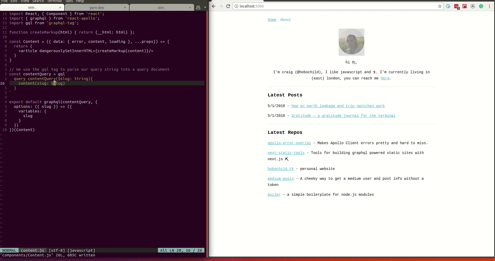

# apollo-error-overlay

> Make apollo errors pretty and obvious

Apollo client passes network and graphql errors as props to you components, this is great for fine grained control, but when you are developing you often want a global errorhandler to catch errors quickly. This package mimics the `react-error-overlay` produce more obvious errors in development.

# Usage

```
import { ApolloClient } from 'apollo-client'
import { HttpLink } from 'apollo-link-http'
import { InMemoryCache } from 'apollo-cache-inmemory'
import { onError } from 'apollo-link-error'
import errorOverlay from 'apollo-error-overlay'

// setup errorLink
const errorLink = onError((errors) => {
  errorOverlay(errors)
  // do what ever else you want with the errors 
})

// setup httpLink
const httpLink = new httplink({
  uri: `http://localhost:80/graphql` 
})

// add links to the client
return new ApolloClient({
  link: errorLink.concat(link),
  cache: new InMemoryCache(),
  defaultOptions: {
    watchQuery: {
      fetchPolicy: fetchPolicy()
    },
    query: {
      fetchPolicy: fetchPolicy()
    }
  }
})
```

## 👀 


